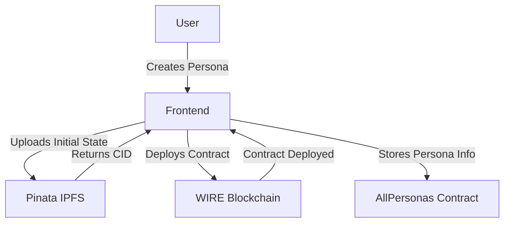
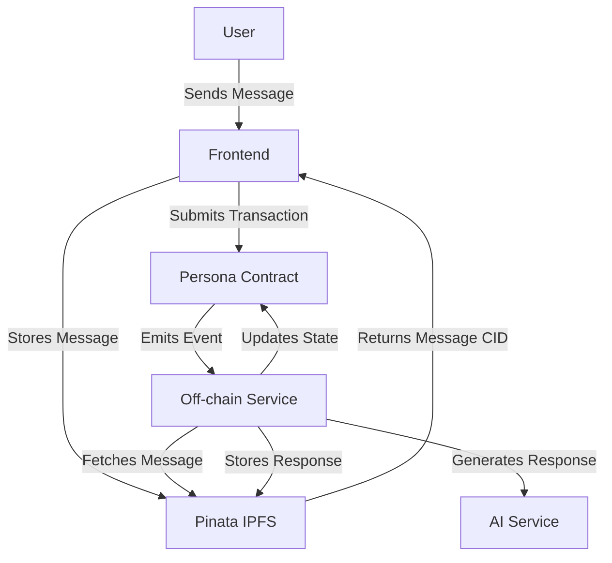

# MutAgent System Architecture

## Overview
MutAgent is a decentralized AI persona system that combines blockchain (WIRE), IPFS (via Pinata), and AI capabilities. The system consists of three main components:
1. Frontend Client (React/TypeScript)
2. Blockchain Layer (WIRE)
3. Off-chain Service (AI/IPFS Handler)

## System Flow

### 1. Persona Creation & Management


#### Key Components:
- **Initial State Format**:
```typescript
interface PersonaState {
    text: string;        // Backstory/context
    timestamp: string;   // Creation time
    persona: string;     // Persona name
    traits: string[];    // Character traits
    user?: string;       // Creator (optional)
    history?: boolean;   // Is historical record
}
```

- **Persona Storage**:
  - Metadata stored on WIRE blockchain
  - Content (backstory, traits) stored on IPFS via Pinata
  - Each persona has its own smart contract

### 2. Chat/Interaction Flow


#### Message Flow Details:
1. User sends message through frontend
2. Message is stored on IPFS via Pinata
3. Message CID is submitted to persona's contract
4. Off-chain service detects new message
5. AI generates response
6. Response is stored on IPFS
7. Contract state is updated with new CIDs

### 3. Data Structures

#### Frontend Types
```typescript
// Persona Information
interface PersonaData {
    name: string;
    backstory: string;
    traits: string[];
    imageUrl: string;
}

// Raw Blockchain Data
interface RawPersona {
    persona_name: string;
}

// Contract Info
interface PersonaInfo {
    persona_name: string;
    initial_state_cid: string;
}
```

#### Smart Contract Tables
```cpp
// In persona contract
struct persona_info {
    uint64_t id;
    string initial_state_cid;
};

struct message_info {
    uint64_t key;
    string pre_state;
    string msg_cid;
    string post_state;
    string response;
};

struct convo_info {
    name account_name;
    string full_convo_history_cid;
};
```

### 4. IPFS/Pinata Integration

The system uses Pinata for reliable IPFS storage and retrieval:

```typescript
class PinataService {
    // Upload content to IPFS
    async uploadJSON(content: any): Promise<string> // Returns CID
    
    // Retrieve content from IPFS
    async getContent(cid: string): Promise<any>
    
    // Check if content exists
    async isContentPinned(cid: string): Promise<boolean>
}
```

Configuration via environment variables:
```env
VITE_PINATA_JWT=your_jwt_token
VITE_WIRE_ENDPOINT=blockchain_endpoint
VITE_WIRE_DEMO_PRIVATE_KEY=private_key
```

### 5. Off-chain Service Requirements

The off-chain service should:

1. **Monitor Blockchain**
   - Watch for new message events in persona contracts
   - Track state changes and conversation history

2. **Handle IPFS Interactions**
   - Fetch message content using CIDs
   - Store AI responses with proper metadata
   - Maintain conversation history

3. **Manage AI Integration**
   - Process user messages with context
   - Generate appropriate responses
   - Maintain persona consistency

4. **Update Contract State**
   - Store response CIDs on chain
   - Update conversation history
   - Maintain state consistency

### 6. Error Handling

The system implements several error handling mechanisms:

1. **IPFS Fallbacks**
   - Retry logic for failed retrievals
   - Content availability checks
   - Error reporting to UI

2. **Transaction Handling**
   - Proper error propagation
   - User feedback for failed transactions
   - State recovery mechanisms

3. **AI Service Failures**
   - Timeout handling
   - Fallback responses
   - Error reporting

### 7. Development Guidelines

1. **Testing**
   - Unit tests for core functionality
   - Integration tests for IPFS interactions
   - Contract testing with local chain

2. **Logging**
   - Comprehensive error logging
   - Transaction tracking
   - Performance metrics

3. **Security**
   - JWT token management
   - Private key handling
   - Rate limiting
   - Input validation

### 8. Important Considerations

1. **State Management**
   - Maintain conversation context
   - Handle concurrent messages
   - Preserve persona consistency

2. **Performance**
   - Optimize IPFS operations
   - Minimize blockchain transactions
   - Cache frequently accessed data

3. **Scalability**
   - Handle multiple concurrent users
   - Manage IPFS storage growth
   - Monitor blockchain resource usage

## API Integration Points

### 1. Blockchain Interactions
```typescript
interface WireService {
    getPersonas(): Promise<RawPersona[]>;
    getPersonaInfo(name: string): Promise<PersonaInfo>;
    submitMessage(params: MessageParams): Promise<void>;
}
```

### 2. IPFS Operations
```typescript
interface IpfsMessage {
    text: string;
    timestamp: string;
    persona: string;
    traits: string[];
    user?: string;
    history?: boolean;
}
```

### 3. AI Service Integration
The off-chain service should implement:
- Message context management
- Persona trait adherence
- Response generation
- State updates

## Conclusion

The off-chain service is a critical component that bridges the blockchain, IPFS, and AI systems. It must maintain consistency, handle errors gracefully, and ensure proper state management across all components. 